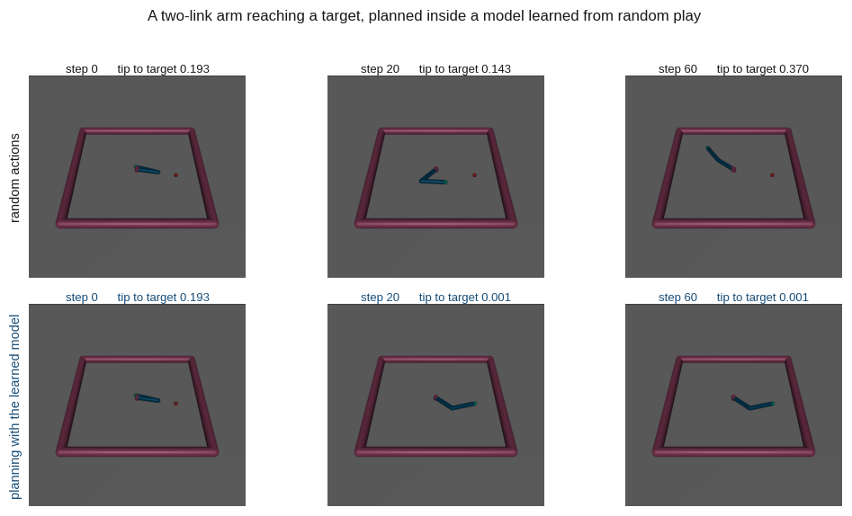
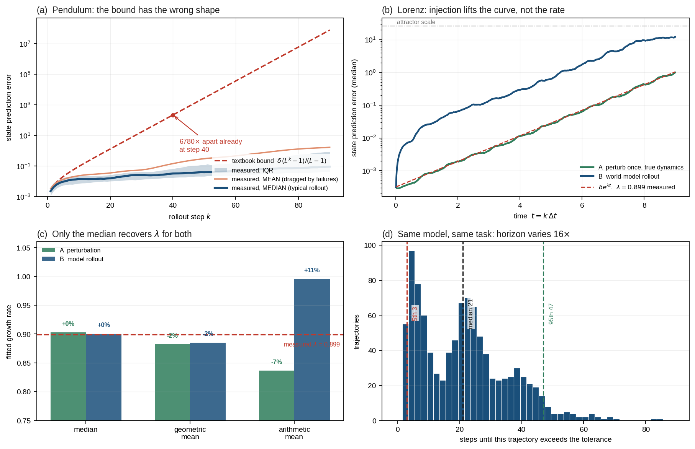
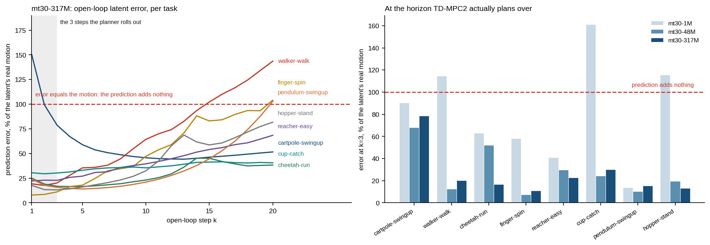
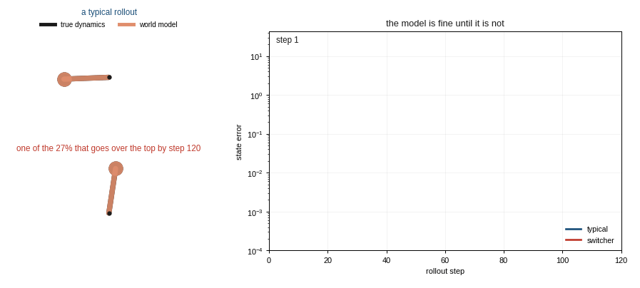
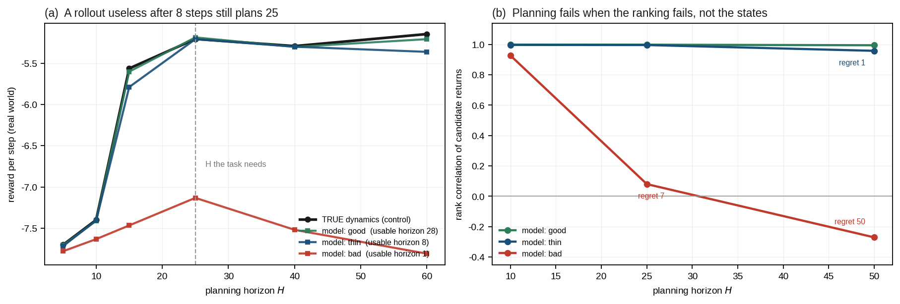
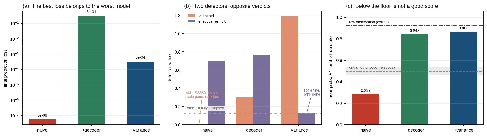
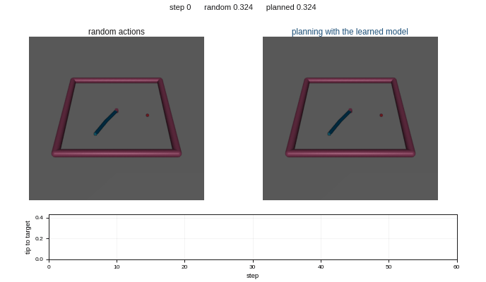
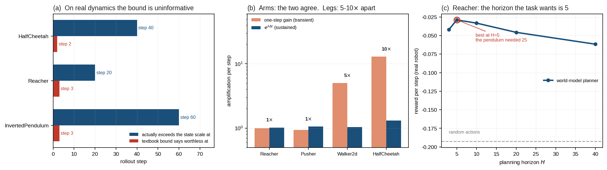

# worldmodel-from-scratch

[](https://github.com/GuoCheng24/worldmodel-from-scratch/actions/workflows/test.yml) [](check_claims.py) [](https://www.python.org/) [](LICENSE)

**Build a world model in an afternoon — then find out where it breaks.**

[中文版](README.zh-CN.md) · MIT · no simulator, no MuJoCo, no OpenGL

A world model predicts where you end up given where you are and what you do.
It is the engine underneath model-based RL, robot policy evaluation, and the
current generation of world-action models. There are good tutorials on how to
build one. This one is about the half nobody teaches: **how far you can trust
the thing once it is built, and what actually governs that.**

<p align="center">
  
</p>

<sub>A MuJoCo arm reaching a target (the small red dot), planned entirely inside
a model learned from random play with no reward signal during training — and the
same planner given random actions instead. Both start in the same pose. Lesson 6
is where this comes from, and <code>make_visuals.py</code> also writes it as an
animation, shown there. This still is here because GitHub wraps animated images
in a play control, so a reader who has asked for reduced motion sees one frame.</sub>

<p align="center">
  
</p>

<sub>All four panels are produced by <code>lessons/02_why_rollouts_drift.py</code>
in under a minute on one GPU. Nothing is illustrative — every number is measured,
and every interval comes from resampling trajectories.</sub>

---

## Why another one

Working through the existing world-model repositories, the same three things
go wrong, and they show up in their issue trackers verbatim:

| | what happens | here |
|---|---|---|
| **Install** | `mujoco.FatalError: gladLoadGL`, `No module named gym.envs.atari`, `Installation broken again` | **`torch`, `numpy`, `matplotlib`.** That is the whole dependency list for Lessons 1–4. Lessons 5–6 add `gymnasium` and `mujoco`, with the one environment variable that makes them work spelled out and tested. |
| **Train** | days of GPU time, and issues titled *"Can you share checkpoint of trained models?"* | **about 10 s and 50 s** on one GPU, together under a minute. Nothing to download. |
| **Read** | issues titled *"Add project explanation"*, *"Why is dyn_discrete always True?"* | The library you have to read is **691 lines**; each lesson is a standalone 60-260 more. Commented for why rather than what. |
| **Break** | — | **This is the point of the repo.** |

## `wm.diagnose()` — the number the reference implementations do not give you

DreamerV3 logs open-loop prediction as a *picture*: six sequences, five steps of
context, the rest imagined, rendered next to the truth with a green-to-red
border where imagination begins, for a human to look at. The official JAX
implementation and the most-used PyTorch port do this identically, and no scalar
leaves the function. TD-MPC2 does report one — `consistency_loss`, an undivided,
`rho`-discounted MSE over its 3-step training horizon, on replay batches, to
wandb but not to the console and not to the saved CSV. None of the three answers
*how many steps ahead is this model still worth trusting, here.*

So this repo writes it once. Two arrays in, one report out; it never touches
your model, so it does not care what framework it is in or whether it predicts
states, latents or flattened pixels.

```python
lam, sd = wm.lyapunov(lorenz, n=300, steps=4000, rng=rng)   # measured, not assumed
report  = wm.diagnose(pred, true, dt=lorenz.dt, lam=(lam, sd))
print(report)          # also a dict: report["horizon"]["p50"]
```

`pred` and `true` are `(n_trajectories, n_steps, state_dim)` — your rollout and
the truth it was supposed to match, from the same starts under the same actions.
On the Lorenz model from Lesson 2 (the whole run is
[`examples/diagnose_lorenz.py`](examples/diagnose_lorenz.py), and this is its
output verbatim):

```
world model rollout diagnosis   600 trajectories x 900 steps, state dim 3

  usable horizon   tolerance 2.787 (10.6% of typical state size)
      5th 333    median 590    95th 853    spread 2.6x    [3% censored]

  growth shape     residuals exp 0.187 / pow 0.797, ratio 4.26 -> exponential
      4.3 decades of range before saturation

  growth rate      by how you summarise trajectories
      median     0.8899  95%CI [0.8784, 0.9004]   -1.6% vs lambda, agrees within lambda's own +-0.084
      geometric  0.8886  95%CI [0.8745, 0.9034]   -1.8% vs lambda, agrees within lambda's own +-0.084
      mean       0.9645  95%CI [0.9282, 1.0211]   +6.6% vs lambda, agrees within lambda's own +-0.084

  read with care
      - the fitted rate moves by 9% depending on whether you summarise
        trajectories by mean, median or geometric mean
```

The last block is the part that matters. It will not hand you a number it cannot
stand behind: if too many trajectories never cross the tolerance it says the
horizon is censored rather than quoting a percentile; if the exponential and
power-law fits are within 50% of each other it says **ambiguous** instead of
picking a winner; and it reports all three summaries because which one you pick
moves the answer by more than most of the effects people publish. This
repository shipped both of those mistakes before the guards existed — the
guards are the fix, kept.

## It runs on a published model, not only on these

`wm.diagnose()` takes two arrays and knows nothing about your model, so it runs
on somebody else's. Here it is on **TD-MPC2's released `mt30` checkpoints**,
using TD-MPC2's own code and environments, loaded through their own
`load_state_dict` with `strict=True`.

<p align="center">
  
</p>

TD-MPC2 plans by rolling its learned dynamics forward **3 steps** and scoring
the result — on every task. Measured across 8 dm_control tasks (640 rollouts
each), at three model sizes, the error at exactly that horizon as a fraction of
how far the latent actually moves:

- **mt30-1M**: median **77%**, and on **3** of 8 tasks above **100%** — at the
  horizon it plans over, the rollout carries less information than assuming
  nothing changes at all.
- **mt30-48M**: median **22%**. Every one of those failures is gone.
- **mt30-317M**: median **18%**. Another 6.6x the parameters buys almost
  nothing, and **5 of the 8 tasks get worse** by 4 to 11 points against a
  rerun spread measured at 1.8.

**The spread across tasks never closes**: worst task over best runs 11.7x, 9.2x,
**7.1x** as the model grows. Scale fixes the catastrophic cases and leaves the
variance, and nothing in the pipeline reports either — the planner rolls the
dynamics forward the same 3 steps on every task at every size.

TD-MPC2 does log `consistency_loss` — an undivided, `rho`-discounted MSE over
those same 3 steps, on replay batches, to wandb but not to the console or the
saved CSV. It is a training loss with no readable scale, and nothing in the
codebase answers *how many steps ahead is this model worth trusting, here*.

Rerunning it takes two commands: **[integrations/tdmpc2/](integrations/tdmpc2/)**
has the pinned environment, the exact invocations, and a second finding — 14 of
the 312 released *single-task* checkpoints are stored in an older parameter
layout and raise a `RuntimeError` with the current code, one no commit in the
public history produces. The other 298 load and run.

## Quick start

```bash
git clone https://github.com/GuoCheng24/worldmodel-from-scratch
cd worldmodel-from-scratch && pip install -r requirements.txt

python lessons/01_a_world_model_in_50_lines.py     # 11 s
python lessons/02_why_rollouts_drift.py            # 56 s
python lessons/03_planning_with_a_model_you_do_not_trust.py   # 74 s
python lessons/04_latent_models_and_collapse.py               # 31 s

# Lessons 5-6 additionally need `pip install gymnasium mujoco`
MUJOCO_GL=egl python lessons/05_real_environments.py          # 65 s
MUJOCO_GL=egl python lessons/06_a_real_robot_arm.py           # 67 s
python make_figures.py                             # redraws the plots above
python make_visuals.py                             # redraws the animations
```

Every number quoted below is produced by those two scripts. To check that
claim rather than take it:

```bash
for f in lessons/*.py; do python "$f" > "/tmp/$(basename $f .py).txt"; done
python check_claims.py /tmp/0*.txt        # 72/72 README claims backed
```

No `--config`, no download, no environment variables. If `torch` imports, it runs.

## The lessons

**1 · A world model in 50 lines.** Build it, train it, and make two
measurements. Predicting the state *change* rather than the next state is 2.1x
more accurate for one line of code — with `dt` small, `s(t+1)` is nearly
`s(t)`, so a direct model is partly rewarded for copying its input. Then the
one that matters: a model with a one-step MSE of `1.5e-05` is **14x worse by
step 20**. The one-step number everyone reports does not tell you what you
want to know.

**2 · Why rollouts drift.** The standard explanation is the compounding-error
bound `e(k+1) <= L·e(k) + δ`, with `L` the Lipschitz constant. This lesson
measures whether it describes anything real.

It does not. On the pendulum it sits **6780x above the measurement at step 40**
and declares the rollout worthless at **step 25**, on a system whose typical
error is still 2% of the state size at step 90. The gap is on every seed.

<p align="center">
  
</p>

<sub>The same start and the same torques, run through the true dynamics and
through the model. Most rollouts stay together; a measured minority goes over
the top and never comes back, and the error between the two groups differs by
two orders of magnitude. That minority is what Lesson 2 is mostly about.</sub>

**What the shape of that curve is, this repository cannot tell you** — and
saying so is a result. Fitting an exponential and a power law to the pendulum's
median error curve gives residuals within 22% of each other. Across six seeds
the winner came out power-law twice and exponential four times. An earlier
version of this file reported "power law" as a finding; it was a coin flip.
`fit_growth` now refuses a verdict when the losing fit is under 1.5x worse, a
threshold set from measurement — synthetic curves of known shape sit at 3 to
23, the curves that flip sit at 1.2.

What survives is the magnitude, which does not move: the bound is wrong by
three to four orders of magnitude at any horizon you would plan over, whatever
the curve's shape is. The reason is that the pendulum's Lyapunov exponent is
`+0.016`, essentially zero, so there is almost nothing to amplify. What you are
watching is errors **accumulating**, not compounding.

### The average you report changes the answer, and it is not a small effect

Everything above used the **median** trajectory. On Lorenz, where the growth
rate itself is at stake, summarising the same rollouts three ways gives:

| | median | geometric mean | arithmetic mean |
|---|---|---|---|
| A perturb once, true dynamics | **+0.5%** | −1.9% | −6.9% |
| B world-model rollout | **+0.2%** | −1.5% | **+10.8%** |

<sub>Deviation of the fitted growth rate from the measured Lyapunov exponent.
The mean's error reproduced on a different machine at −7.1% and +12.3%.</sub>

Only the median recovers λ for both, and the mean errs in *opposite directions*
for the two curves, so it is not a bias you can correct for after the fact. If
you benchmark a world model on mean rollout error, this is a cost you are
paying and not reporting.

**The mechanism is concrete.** A pendulum driven by random torque can be pushed
over the top; once model and truth are on opposite branches the error is O(π)
and stays there. By step 90, **14% of rollouts have switched branch**. Those
14% are what the mean curve is mostly describing, and the typical rollout never
does what the mean says it does — which is what the animation above shows.

On the pendulum this sometimes goes further and the two summaries give
different functional *forms*, the median a power law and the mean an
exponential. That one is not reliable: across six seeds it happened twice.
Reported here because it is worth checking on your own system, not because it
is a property of world models.

### What actually sets the rate

The **Lyapunov exponent** — the average log-growth along the trajectory — not
`L`, the worst case over every state and direction. The lesson measures λ
directly with Benettin's method (Lorenz: `0.899`, against a literature value of
0.906, measured rather than quoted), then separates the two effects that
usually get conflated:

- **amplification** — the dynamics stretching an error that is already there
- **injection** — the model adding a fresh error at every single step

Perturb the true system *once* and you isolate amplification; run the model and
you get both. On the median trajectory, with intervals from resampling
trajectories:

| | growth rate | 95% CI | vs measured λ |
|---|---|---|---|
| **A** perturb once, true dynamics | 0.9030 | [0.8956, 0.9098] | +0.5%, covers λ |
| **B** world-model rollout | 0.9005 | [0.8872, 0.9112] | +0.2%, covers λ |

**Amplification alone grows at exactly the Lyapunov rate.** Curve A's interval
covered λ on six seeds out of six — the one result in this lesson that never
moved. Curve B, the full model rollout, lands near λ but not reliably on it: it
covered λ on two seeds of six and missed high on the other four, always by under
15%. So the honest form is *injection does not change the growth rate to within
about 15%*, not *it does not change it*. The lesson prints whichever the run
found and says how the seeds came out.

What injection does is lift the whole curve by a constant — measured here at 13
to 30 depending on the estimator, and 8 to 28 across seeds.

Two predictions bracket that: if successive model errors *aligned* they would
sum to ~111x, if they were *independent* the pile-up would be ~7.5x. The
measurement sits between them and, on this run, **does not distinguish the
two** (3.7x from one, 4.0x from the other). Earlier seeds landed near 11, which
does favour independence. The lesson prints whichever verdict the run supports,
including "cannot tell", and this is one of the open questions below.

### Horizon is not one number per model

On the same model and the same task, the 5th and 95th percentile trajectories
differ by **16x** in how many steps they survive. A fixed rollout horizon is too
long for the worst of them and needlessly short for the best.

## Open questions

Genuine ones, not decoration. If you have an answer, it is worth an issue.

1. **Is the pile-up factor closer to the independent or the aligned
   prediction?** The measurement moves between 8 and 30 with the estimator and
   the seed, which straddles the midpoint between 7.5 and 111. Separating them
   needs a better estimator than the ratio of two noisy curves.
2. **Why does the arithmetic mean bias the two Lorenz curves in *opposite*
   directions?** Both have log-error dispersion that widens with time, which
   predicts inflation for both. The model rollout inflates by +11%; the single
   perturbation deflates by −7%. A lognormal σ²/2 correction fits neither.
   Wrong-lobe events are the obvious suspect — by t=9, 97% of rollouts have
   ended up on the wrong lobe of the attractor — but conditioning on survival
   to test it introduces its own selection bias, and we could not remove it
   cleanly.
3. **Does any of this survive on pixels?** Everything here is a fully observed
   low-dimensional state. See Honest scope.

**3 · Planning with a model you do not trust.** Lesson 2's usable horizon looks
like it should decide the planning horizon. It does not, and the gap is large.

The task is a pendulum swing-up with a torque limit of 3.0 against a peak
gravitational torque of 9.81 — you cannot push it up, you have to rock it, so a
planner is genuinely required. Three models are trained, differing only in how
much data they saw:

| model | one-step MSE | usable horizon | reward at H=25 | vs the TRUE dynamics |
|---|---|---|---|---|
| good | 3.5e-04 | 28 steps | −5.19 | +0.02 |
| thin | 1.6e-03 | **8 steps** | −5.21 | **−0.00** |
| bad | 5.3e-02 | 1 step | −7.13 | −1.93 |

**A model whose rollout is unusable after 8 steps plans 25-step action sequences
at no measurable cost**, against a planner handed the exact true dynamics. The
shortest horizon that suffices is 25 for every row including the true dynamics,
so it is set by the task — how long a swing-up takes — not by model quality.

The reason is that a planner never uses the states a model predicts. It uses
them to *rank* candidate action sequences, then throws them away and executes
one action. Ranking outlives the states by a wide margin:

| model | H | state error | rank correlation | regret |
|---|---|---|---|---|
| thin | 25 | 0.232 | **0.995** | **0.000** |
| bad | 25 | 3.196 | 0.080 | 6.938 |
| bad | 50 | 8.255 | −0.270 | 49.610 |

<sub>Regret is the true return of the best sequence minus that of the one the
model picked. Zero means the model's choice was actually optimal.</sub>

Planning breaks when the *ranking* breaks. That is the number to measure before
trusting a planner, and it is not the one Lesson 2 taught you to compute.

<p align="center">
  
</p>

**The trap this lesson opens with.** A planner needs two dynamics: one to
imagine with, one to actually move the world. Use the model for both and the
reward is scored on states the model invented:

| model | reward in its own dream | reward in the real world |
|---|---|---|
| good | −5.20 | −5.19 |
| thin | −5.24 | −5.21 |
| **bad** | **−1.75** | **−7.13** |

The worst model wins by a wide margin, because it imagines the pendulum already
balanced. Nothing errors. `wm.cem_mpc` takes the two dynamics as separate
required arguments so that writing this by accident is not possible.

**4 · Latent world models, and the collapse you cannot see in the loss.** Real
world models see pixels, so they encode first and predict in latent space.
Training that on `||f(e(o), a) − e(o')||²` has an exact trivial optimum: make
the encoder constant. Here are the naive objective and two standard fixes, on
observations that are 16 dimensions of pendulum and 48 of irrelevant moving
background:

| objective | prediction loss | latent std | effective rank | probe R² |
|---|---|---|---|---|
| naive | **5.5e-08** | 0.0003 | 5.62 | **0.287** |
| +decoder | 3.0e-01 | 0.3059 | 6.08 | 0.845 |
| +variance | 3.3e-04 | 1.1888 | **1.01** | 0.868 |
| *untrained encoder (floor)* | — | — | — | *0.500* |
| *raw observation (ceiling)* | — | — | — | *0.923* |

**The best loss belongs to the only representation that scores below an
untrained encoder.** Seven orders of magnitude of loss improvement bought a
model worse than random features, and nothing in the training curve says so.

Then all three collapse detectors disagree. Latent std catches `naive` and
passes `+variance`; effective rank passes `naive` and fails `+variance`. Both
are right about something: std is blind to direction, effective rank is
computed from the shape of the spectrum and is blind to scale. Neither is a
collapse detector on its own, and the probe only means anything against a
floor — a random encoder gets 0.500 for free.

<p align="center">
  
</p>

**5 · Real environments.** Everything so far ran on two systems written by hand
in this repository. This lesson repeats the measurements on three MuJoCo
environments and reports which findings survive.

Installing is two packages and one environment variable, and the variable is the
whole game on a headless machine:

```bash
pip install gymnasium mujoco
export MUJOCO_GL=egl        # before mujoco or gymnasium is imported
```

| `MUJOCO_GL` | what happens here |
|---|---|
| unset | `mujoco.FatalError: an OpenGL platform library has not been loaded` |
| `glfw` | the same, after a GLFW X11 warning |
| `osmesa` | `AttributeError` inside PyOpenGL |
| **`egl`** | **works** |

One wrong combination aborts the process rather than raising, so a `try/except`
around the render call does not save you. The consolation: none of these
measurements render anything. They need states, not pictures.

**The bound gets worse, and the honest way to say so.** Quoting "overestimates by
1e56 at step 60" is true and useless — `L^k` on real dynamics is astronomical
and reads as a straw man. The useful form is when each claim the rollout is
finished:

| environment | `L_max` | bound says worthless at | actually is at |
|---|---|---|---|
| InvertedPendulum | 9.2 | **step 3** | still fine at 60 |
| Reacher | 18.3 | **step 3** | step 21 |
| HalfCheetah | 15099 | **step 2** | still fine at 40 |

<sub>The exact step moves by one between runs. What does not move is that the
bound speaks in single digits about systems that stay usable for tens of steps,
so the lesson prints the measured range rather than these numbers.</sub>

**What survives, and what needed a qualification.** The horizon spread carried
over everywhere (1.6x to 19x). The median-versus-mean divergence appeared in 0
or 1 of 3 environments depending on the run — which is itself the finding: on
the pendulum in Lesson 2 it reproduced every time, here it does not, so it is a
risk to check on your own system rather than a property of world models.

And one result turned out to be about the regime rather than about world
models. **Lesson 2's rate-equals-lambda finding needed a chaotic system, an
accurate model, and four decades of range before saturation.** On all three
MuJoCo environments the median curve is a power law, so the exponential rate is
a fit that lost and comparing it to λ would be reading a number out of the wrong
model. Amplification needs something to amplify; on a robot with an imperfect
model, injection dominates the entire horizon you plan over. Lesson 2 now says
so, and points here.

**6 · A real robot arm.** Two questions, on MuJoCo arms and legs.

**Why is the bound catastrophic on some robots and merely loose on others?**
Perturb a state by 1e-6, take one step, measure the gain, and compare it to the
sustained rate:

| | one-step gain | `exp(λ·Δt)` | ratio |
|---|---|---|---|
| Reacher (arm) | 1.00 | 1.020 | **1.0** |
| Pusher (arm) | 0.93 | 1.058 | **0.9** |
| Walker2d (leg) | 5.35 | 1.032 | **5.2** |
| HalfCheetah (leg) | 14.63 | 1.313 | **11.1** |

A random perturbation first picks up the largest singular value of the
Jacobian; only once it rotates into the growing direction does it settle to λ.
**The textbook bound compounds the first number as if it were the second.** On
an arm the two coincide and the bound is merely loose. On a leg they differ by
5–11x *per step*, which is why Lesson 5 saw it write rollouts off at step 2.

**Can a learned world model actually drive the arm?** Reacher, from a random-play
dataset with no reward signal during training:

<p align="center">
  
</p>

| planner | reward/step | final fingertip-to-target |
|---|---|---|
| random actions | −0.2045 | — |
| world model, H=3 | −0.0271 | 0.0005 |
| **world model, H=5** | **−0.0207** | 0.0009 |
| world model, H=20 | −0.0341 | 0.0076 |
| world model, H=40 | −0.0451 | 0.0243 |

**The horizon the task wants is 5 here, where the pendulum swing-up needed 25.**
Both are the task's answer: a swing-up must pump energy over many steps before
anything good happens, and reaching does not — greedy descent is already right,
so a longer horizon only buys more model error. Lesson 3's pendulum never showed
that cost because its model stayed accurate across the whole sweep. Same claim,
opposite-looking curve.

And the quantity Lesson 3 identified, on the real arm:

| H | state error | rank correlation | regret |
|---|---|---|---|
| 5 | 0.344 | 0.998 | 0.0000 |
| 20 | 4.51 | 0.958 | 0.0000 |
| 40 | 12.13 | 0.647 | 1.0522 |

The state drifts by more than 30x between H=5 and H=40 while the ranking holds,
and the planner pays nothing until the ranking goes.

<p align="center">
  
</p>

## What is coming

Pixel observations, and a latent world model driving the arm from them — which
is where Lessons 4 and 6 meet.

## A note on how this is written

Every verdict the lessons print is **computed from that run**, not written in
advance. When the evidence is too thin, the script says so instead of
asserting a conclusion — Lesson 2 will refuse to quote a horizon spread if too
many trajectories were censored, and refuse to call a curve exponential if
there is not enough dynamic range to tell. Tutorials that hard-code their
conclusions into `print` statements drift away from their own numbers the
moment a parameter changes. `check_claims.py` makes that failure impossible to
ship quietly: it greps the README's numbers out of a captured run and exits
non-zero if any of them is missing.

**Every table above is one recorded run.** Third digits move between runs, and
some second digits do: the pile-up factor in Lesson 2 has landed anywhere from
8 to 28 across seeds, Lesson 5's bound-versus-reality step shifts by one, and
Lesson 5's median-versus-mean divergence appears in 0 or 1 of 3 environments
depending on the run. `check_claims.py` is written to that reality — it verifies
the qualitative verdict and the order of magnitude, not the last digit, and
where a quantity is genuinely unstable the lesson says so in its own output
rather than letting the README imply otherwise. Anything stated here as a
conclusion has held across every run we have done; anything that has not is
labelled.

## What the badges actually cover

A green badge that quietly stands behind less than it appears to is the same
failure this repository is about, so here is the scope in full.

Every claim in `check_claims.py` is marked **stable** or not:

- **stable** — a qualitative verdict, an order of magnitude, or a statement the
  lesson makes about its own reliability. These held on every seed and every
  machine we have run them on.
- the rest quote numbers from the run that produced this README. They will not
  match a different seed or a different CPU, and that is a measurement rather
  than a defect: a first CI build backed 14 of 25, and all eleven misses were
  real drift.

| | runs in CI | checked before release |
|---|---|---|
| 34 library controls (`tests/`) | ✓ on Python 3.9, 3.11, 3.12 | ✓ |
| Lessons 1–2, **stable claims** | ✓ | ✓ |
| 7 TD-MPC2 numbers, recomputed from the committed `.npz` | ✓ needs neither GPU nor checkpoint | ✓ |
| Lessons 1–2, recorded numbers | ✗ different CPU | ✓ |
| Lessons 3–6 | ✗ wants a GPU or MuJoCo | ✓ |

```bash
python check_claims.py /tmp/0*.txt                 # 72/72 against the recorded run
python check_claims.py --stable-only /tmp/0*.txt   # what should hold anywhere
```

CI runs the second form and prints the subset it stands behind. Running the
full set there would fail honestly on every build and teach everyone to ignore
the badge; running only the loose half locally would let the README drift. Both
are checked, each where it means something. An empty selection exits non-zero —
a check that matched nothing is not a check that passed.

The `tests/` suite is not a unit-test suite. Each case is one where the answer
is known independently — the Lorenz exponent against its literature value, a
finite-difference Jacobian against the analytic one, a synthetic curve of known
shape, a confidence interval against its nominal coverage — plus negative
controls, which catch more: a metric that reports something sensible on
structureless data will report something sensible on a broken model too.

Four of those tests exist because a bug got past everything else:
`test_action_dim_is_not_hard_coded` (one wrong constant, in two functions, found
when Lesson 6 tried a two-joint arm), `test_the_interval_covers_the_truth...`
(bootstrapping the points of one averaged curve instead of the trajectories,
which halved every interval), and the two shape tests, which now also check that
an ambiguous curve is called ambiguous instead of being given a coin-flip
verdict.


## Honest scope

The lessons use 2-D and 3-D systems with fully observed states, chosen because
the true dynamics are known exactly — which is what makes "how wrong is the
model" a question with an answer. Lessons 5 and 6 carry that into MuJoCo, and
[integrations/tdmpc2/](integrations/tdmpc2/) carries `wm.diagnose()` onto a
published latent-space world model.

**What has still not been checked is a pixel-based world model, or DreamerV3.**
The findings about growth shape and rate should be read as precise statements
about a setting where everything is measurable, not as established facts about
video world models. The TD-MPC2 run measures a real model but shares one of its
limits: with no decoder, encoder drift and dynamics error are not separable, so
what is reported there is the two together — which is also what the planner
gets.

## Related work, and what it is good for

If you want a large-scale video world model, go to
[minWM](https://github.com/shengshu-ai/minWM). For a working PyTorch DreamerV3,
[NM512/dreamerv3-torch](https://github.com/NM512/dreamerv3-torch). For TD-MPC2,
[nicklashansen/tdmpc2](https://github.com/nicklashansen/tdmpc2). For a reading
list, [Awesome-WAM](https://github.com/OpenMOSS/Awesome-WAM). This repo is not
a replacement for any of them — it is the thing to read first, and the thing to
come back to when a rollout has gone wrong and you want to know why.

Companion: [world-model-map](https://github.com/GuoCheng24/world-model-map) —
what the authors of the major open world models say breaks in their own papers.

## License

MIT © Guo Cheng
