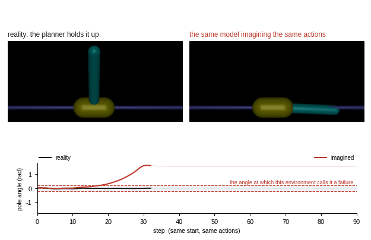
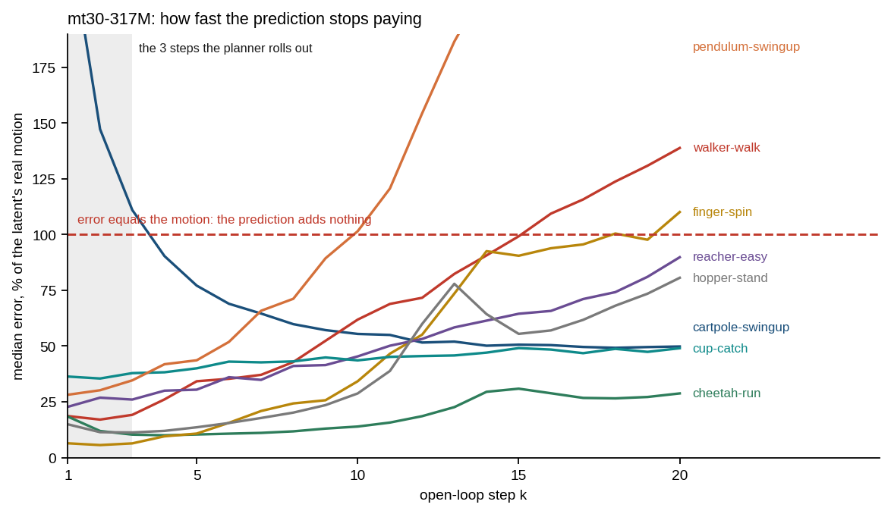
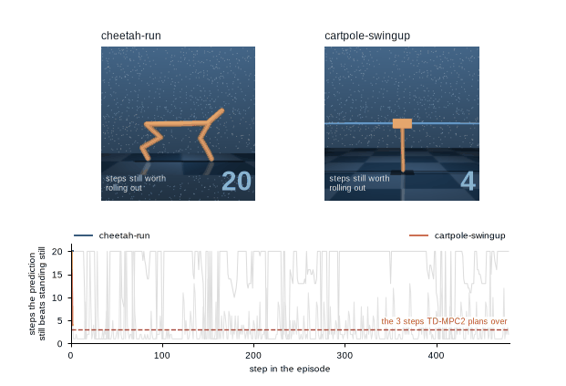
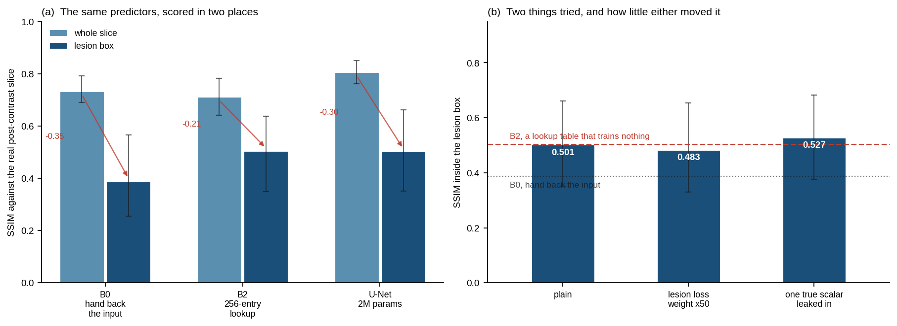

# worldmodel-from-scratch

[](https://github.com/GuoCheng24/worldmodel-from-scratch/actions/workflows/test.yml) [](check_claims.py) [](https://www.python.org/) [](LICENSE)

**一个下午写出一个世界模型 —— 然后搞清楚它能信到第几步。**

[English](README.md) · MIT · 不装仿真器、不装 MuJoCo、不装 OpenGL——直到第 5 课

世界模型回答一件事:给定你在哪、你做什么,你会到哪里去。它是 model-based RL、
机器人策略评测、以及这一代 world-action model 底下的引擎。教你**怎么造**一个的
教程已经有不少,这个仓讲的是没人教的另一半:**造出来之后它还能对多久、
这件事由什么决定,以及——怎么在一个不是你训的模型上把它量出来。**

由此出来两样东西:**六课**,在真实动力学精确已知的系统上测出各种失效模式
(这样"模型错了多少"才是个有确切答案的问题);以及 **`wm.diagnose()`**,
一次调用就能把同样的测量做在任何模型上,**包括别人已经发表的模型**。

<p align="center">
  
</p>

<sub><b>一个好到足以控制这个系统的模型,二十步左右就已经搞错了它。</b>
<b>左</b>——规划器用一个从随机游玩数据学来的模型把杆立住,90 步全程,每次运行都做到。
<b>右</b>——同一个模型、同一起点、同一串动作,想象它们会把杆带到哪:
它想象的杆在**第 13 到 23 步之间**(五次运行、每次重训)越出这个环境判定失败的角度,
而真实的那根从没越过。1e-03 量级的单步损失对此只字未提。
两边都是模拟器——把想象出的状态塞回 MuJoCo 渲染,而这正是潜空间模型做不到的。
<code>make_imagination.py</code>。</sub>

<p align="center">
  
</p>

<sub>以及把同一套测量对准一个**不是这个仓训的**模型:TD-MPC2 官方发布的
<code>mt30</code> checkpoint,走它们自己的代码。<b>左</b>——在它的规划器真正前推的视界处,
学到的动力学有多大比例的起点上输给"假设状态没变"。参数涨 48 倍能修好,再涨 6.6 倍不能;
而 <code>cartpole-swingup</code> 上它随规模逐级恶化。<b>右</b>——预测还能赢几步,
这个数**即便在同一个任务内部也不是一个数**。</sub>

---

## 为什么还要再写一个

把现有的世界模型仓库逐个跑一遍,同样三件事反复出问题,而且在它们的 issue 区
里是原话:

| | 别处发生的 | 这里 |
|---|---|---|
| **装** | `mujoco.FatalError: gladLoadGL`、`No module named gym.envs.atari`、`Installation broken again` | **`torch`、`numpy`、`matplotlib`。** 第 1–4 课的依赖就这三个。第 5–6 课加 `gymnasium` 和 `mujoco`,那个让它们能跑起来的环境变量已写明并实测。 |
| **训** | 要几天 GPU,issue 标题是 *"Can you share checkpoint of trained models?"* | 单卡**约 10 秒和 50 秒**,两课加起来不到一分钟。没有任何东西要下载。 |
| **读** | issue 标题是 *"Add project explanation"*、*"Why is dyn_discrete always True?"* | 你真正要读的库是 **946 行**;每一课再 72–321 行且互相独立。注释解释的是**为什么**这样写,不是这行在干嘛。 |
| **坏** | —— | **这才是这个仓存在的理由。** |

## `wm.diagnose()` —— 那些参考实现不给你的那个数

DreamerV3 把开环预测记录成一张**图**:六条序列,前五步是给定上下文、其余靠想象,
和真值并排画出来,交界处用绿转红的边框标出,供人**用眼睛看**。
官方 JAX 实现和最常用的 PyTorch 移植版做法完全一致,没有任何标量从那个函数里出来。
TD-MPC2 确实报了一个——`consistency_loss`,那是它 3 步训练视界内、带 `rho` 折扣、
**未做任何归一化**的 MSE,在回放数据上算,上报到 wandb,但不进控制台、也不进保存的 CSV。
三者没有一个回答:*在这个任务上,这个模型往前几步还值得信。*

所以这个仓把它写一次。进两个数组,出一份报告;它完全不碰你的模型,
所以不在乎你用什么框架,也不在乎你预测的是状态、潜变量,还是拉平的像素。

```python
lam, sd = wm.lyapunov(lorenz, n=300, steps=4000, rng=rng)   # 测出来的, 不是假设的
report  = wm.diagnose(pred, true, dt=lorenz.dt, lam=(lam, sd))
print(report)          # 它同时也是个 dict: report["horizon"]["p50"]
```

`pred` 和 `true` 的形状是 `(轨迹数, 步数, 状态维度)`——你的 rollout,
以及它本该匹配的真值,**同样的起点、同样的动作序列**。
在第 2 课那个 Lorenz 模型上(完整的那次运行就是
[`examples/diagnose_lorenz.py`](examples/diagnose_lorenz.py),下面这块是它的**原样输出**):

```
world model rollout diagnosis   600 trajectories x 900 steps, state dim 3

  usable horizon   tolerance 2.787 (10.6% of typical state size)
      5th 333    median 590    95th 853    spread 2.6x    [3% censored]

  growth shape     residuals exp 0.187 / pow 0.797, ratio 4.26 -> exponential
      4.3 decades of range before saturation

  growth rate      by how you summarise trajectories
      median     0.8899  95%CI [0.8784, 0.9004]   -1.6% vs lambda, agrees within lambda's own +-0.084
      geometric  0.8886  95%CI [0.8745, 0.9034]   -1.8% vs lambda, agrees within lambda's own +-0.084
      mean       0.9645  95%CI [0.9282, 1.0211]   +6.6% vs lambda, agrees within lambda's own +-0.084

  read with care
      - the fitted rate moves by 9% depending on whether you summarise
        trajectories by mean, median or geometric mean
```

真正要紧的是最后那一块。**它不会给你一个它站不住的数**:
如果太多轨迹从未越过容差,它会说可用步数被**截尾**了,而不是硬报一个分位数;
如果指数拟合和幂律拟合的残差相差不到 50%,它会说 **ambiguous**,而不是挑一个赢家;
它同时报三种汇总方式,因为你选哪一种,答案的变化幅度比很多人发表出来的效应还大。
这个仓自己先犯过上面这两个错——这些护栏就是当时的修法,被留了下来。

## 它能跑在已发表的模型上,不只是跑在这几个玩具系统上

`wm.diagnose()` 只吃两个数组、对你的模型一无所知,所以它能直接跑在别人的模型上。
下面是它跑在 **TD-MPC2 官方发布的 `mt30` checkpoint** 上的结果——用的是 TD-MPC2
自己的代码和环境,经它们自己的 `load_state_dict` 以 `strict=True` 加载。

<p align="center">
  
</p>

<sub>最大的那个发布模型上,每个任务的预测多快就不再划算。灰带是规划器前推的那 3 步;
虚线是"误差等于潜变量实际移动距离"的位置。</sub>

TD-MPC2 规划时把学到的动力学**前推 3 步**再打分——在每一个任务上都是 3 步。
这个规划值不值钱,取决于它和一个**最平凡的基线**比:在那个视界处,
有多大比例的起点上,它的预测**还不如"假设状态根本没变"**?
在 8 个 dm_control 任务上测量(每个任务 640 条 rollout)、跨三个模型规模:

- **mt30-1M**:中位任务上有 **48%** 的起点——**一半**;`hopper-stand` 上是 **79%**。
  这条 rollout 没给规划器带来任何信息。
- **mt30-48M**:**4%**。参数涨 48 倍把它修好了,8 个任务里有 3 个降到 1% 及以下。
- **mt30-317M**:**4%**。再涨 6.6 倍,**什么也没买到**。

而 `cartpole-swingup` 上这个比例**随规模逐级上升——42%、44%、57%**。
规模修掉了灾难性的那几个,然后就停了。

**而这件事的后果比听上去小得多,这才是有意思的地方。** 用 TD-MPC2 自己的评测跑同一批
checkpoint,`cartpole-swingup`——三个规模上预测最差的那个任务——**在 317M 上拿到 754/1000**。
规划器把任务做成了,而它用来给候选动作打分的那条 rollout,在多数起点上还不如"假设什么都没变"。
它每一步都重新规划、并用价值函数兜住尾巴,显然这就够了。

**所以这两个数谁也替代不了谁。** 在这八个任务上,回报与该比例的秩相关在 1M / 48M / 317M
分别是 **+0.43、−0.86、−0.12**——**没有稳定关系,两个方向都没有**。奖励曲线不告诉你模型知道什么,
而这个数也不告诉你智能体能不能成功——**这和本文开头那张动图讲的是同一件事**,
只不过那里的系统小到可以直接画出来。

<p align="center">
  
</p>

<sub>它也不是"每个模型一个数"。把同一个问题问在一集里的**每一步**——
从这一刻起,模型往前几步还值得推——答案在一集之内反复崩塌又恢复;
而共享全部权重的两个任务,处在完全不同的区间。</sub>

TD-MPC2 确实记录了 `consistency_loss`——那是同样 3 步内、带 `rho` 折扣、**未做任何
归一化**的 MSE,在回放数据上算,上报到 wandb,但不进控制台、也不进保存的 CSV。
它是一个训练损失,没有可读的尺度;代码库里没有任何东西回答
*"在这个任务上,这个模型往前几步还值得信"*。

## 同一种病,换一个和机器人毫无关系的领域

一个把非增强 MRI 层变成增强层的模型,预测的正是"施加干预之后系统怎么演化"——
而那个领域自己也开始这么说了,叙述已经从"图像翻译"移到了对比剂**动力学**。
于是这里的第一个问题原样迁移过来:**最平凡的那个预测器,已经能拿多少分?**

<p align="center">
  
</p>

在公开的乳腺 DCE-MRI 上,一个 2M 参数的 U-Net 在**整层**上比"原样交回输入"高
**+0.07 SSIM、+4.1 dB**。**而在病灶框内——就是那几百个、造影剂正是为它们才被注射的像素——
它只和一张 256 格、只看单个体素、没有任何空间上下文的查找表打平。**
把病灶处的损失加权 50 倍,纹丝不动;数据涨 5 倍,也只是追平那张查找表,没有超过。

一张乳腺 MRI 层里大部分是脂肪、肌肉、空气和胸壁,它们都不强化。
全局指标由"什么都不做才是对的"那部分主导,因此它**分不出**
"建模了强化"和"保住了解剖"——这和 TD-MPC2 那个"规划器把任务做成了,
而它用来打分的 rollout 还不如假设状态没变"是同一个形状。
**[integrations/dce-mri/](integrations/dce-mri/)** 里有取数脚本、评测协议、
一个**如实报成空结果的对照**,以及那个"跳过就会让全部结论变成虚构"的索引陷阱。

复现只要两条命令:**[integrations/tdmpc2/](integrations/tdmpc2/)** 里有钉死的环境、
精确的调用方式,以及第二个发现——官方发布的 312 个**单任务** checkpoint 里,
有 14 个用的是更早的参数布局,当前代码加载它们会直接 `RuntimeError`,
而公开历史上没有任何一个提交产出过那种布局。其余 298 个可以正常加载运行。

## 快速开始

```bash
git clone https://github.com/GuoCheng24/worldmodel-from-scratch
cd worldmodel-from-scratch && pip install -r requirements.txt

python lessons/01_a_world_model_in_50_lines.py     # 11 秒
python lessons/02_why_rollouts_drift.py            # 56 秒
python lessons/03_planning_with_a_model_you_do_not_trust.py   # 74 秒
python lessons/04_latent_models_and_collapse.py               # 31 秒

# 第 5-6 课另需 `pip install gymnasium mujoco`
MUJOCO_GL=egl python lessons/05_real_environments.py          # 65 秒
MUJOCO_GL=egl python lessons/06_a_real_robot_arm.py           # 67 秒
python make_figures.py                             # 重画上面的静态图
python make_visuals.py                             # 重画上面的动图
MUJOCO_GL=egl python make_imagination.py           # 40 秒, 生成开头那张动图
```

<sub>这些秒数是在**一块 GPU** 上测的。第 1–4 课除了上面那三个包什么都不需要,纯 CPU 也能跑,
但代价是真实的、而且并不均匀:8 线程 CPU 实测,第 1、4 课慢 3 倍,第 3 课 6 倍,第 2 课 10 倍,
四课合计约 **19 分钟**而不是 3 分钟。</sub>

下面引用的每一个数字都由这两个脚本产生。**不用信,可以直接查:**

```bash
# 只用上面那三个包,跑第 1–4 课:
for f in lessons/0[1-4]*.py; do python "$f" > "/tmp/$(basename $f .py).txt"; done
python check_claims.py --lessons=1,2,3,4 /tmp/0*.txt     # 58/58

# 装了 gymnasium 和 mujoco 之后,跑全部六课:
for f in lessons/*.py; do MUJOCO_GL=egl python "$f" > "/tmp/$(basename $f .py).txt"; done
python check_claims.py /tmp/0*.txt                       # 81/81
```

没有 `--config`,哪一步都不用下载。第 1–4 课也不需要任何环境变量——`torch` 能 import 就能跑。
第 5–6 课在无显示的机器上要 `MUJOCO_GL=egl`,这是本仓库**唯一**的一个环境变量,
并且已写进每一条需要它的命令里。

## 课程

**第 1 课 · 50 行的世界模型。** 造出来、训好、做两次测量。
预测状态**增量**而不是下一个状态,只差一行代码,精度更高——参考机器上 2.1 倍,单核 CPU 上 1.4 倍,方向从不翻转——因为 `dt` 很小时
`s(t+1)` 几乎就是 `s(t)`,直接预测的模型会因为"照抄输入"而部分得分。
然后是真正要紧的那个:一个单步 MSE 只有 `1.5e-05` 的模型,**到第 20 步误差是单步的
14 倍**。所有人都在报的那个单步数字,并不回答你真正想问的问题。

**第 2 课 · rollout 为什么会漂。** 标准解释是复合误差界
`e(k+1) <= L·e(k) + δ`,其中 `L` 是 Lipschitz 常数。这一课测它到底描述了什么。

答案是:什么也没描述。在摆上,它**第 40 步比实测高出 6780 倍**,并在**第 25 步**就宣布 rollout 报废,
而这个系统到第 90 步典型误差仍只有状态尺度的 2%。这个差距在每个种子上都在。

<p align="center">
  
</p>

<sub>这一课做的四个测量。<b>(a)</b> 教科书那条界,对上它本该描述的摆。
<b>(b)</b> Lorenz,把误差**注入**和误差**放大**分开。
<b>(c)</b> 同一批 rollout 用三种方式汇总,只有中位数还原出 λ。
<b>(d)</b> 同一个模型在同一个任务上能走多远——是个**分布**,不是一个数。
四张全部由 <code>lessons/02_why_rollouts_drift.py</code> 在单卡一分钟内产生;
没有一个数字是示意的,每个置信区间都来自对轨迹的重采样。</sub>

<p align="center">
  
</p>

<sub>同一个起点、同一串力矩,分别喂给真实动力学和模型。大多数 rollout 始终重合;
实测有一小撮会翻过顶点再也回不来,两组的误差差**两个数量级**。第 2 课讲的主要就是这一小撮。</sub>

**至于那条曲线是什么形状,这个仓库告诉不了你——而说出这一点本身就是结论。**
对摆的中位误差曲线分别拟合指数和幂律,两者残差只差 **22%**。跨六个种子,
胜者是**幂律 2 次、指数 4 次**。这份文档的早先版本把"幂律"当成发现写了出来,**那是在报告一次抛硬币**。
`fit_growth` 现在在落败的拟合不到 1.5 倍差时**拒绝下判决**;这个阈值是量出来的——
已知形状的合成曲线残差比在 3 到 23 之间,而会翻转的真实曲线在 1.2。

**活下来的是量级,它不动**:无论曲线什么形状,那条界在任何你会用来规划的步长上都错三到四个数量级。
原因是摆的 Lyapunov 指数只有 `+0.016`,基本为零,**没有什么可放大的**——你看到的是误差在**累加**,不是在复合。

### 你报哪种平均,答案就不一样,而且差别不小

上面用的是**中位**轨迹。在 Lorenz 上——那里增长率本身就是被争论的量——
同一批 rollout 用三种方式汇总:

| | 中位数 | 几何平均 | 算术平均 |
|---|---|---|---|
| A 只扰动一次,真实动力学 | **+0.5%** | −1.9% | −6.9% |
| B 世界模型 rollout | **+0.2%** | −1.5% | **+10.8%** |

<sub>拟合增长率相对实测 Lyapunov 指数的偏离。均值的误差在另一台机器上复现为 −7.1% 与 +12.3%。</sub>

**只有中位数在两条曲线上都还原出 λ**,而均值对两条曲线的偏离**方向相反**,
因此这不是一个事后能校正的偏差。如果你用平均 rollout 误差给世界模型做 benchmark,
这是一笔你在付、却没有报告的成本。

**机制是具体的。** 随机力矩驱动的摆可能被推过顶点;一旦模型和真值落在相反分支上,
误差就是 O(π) 量级并且回不来。到第 90 步,**14% 的 rollout 已经换支**。
均值曲线描述的主要就是这 14%,而**典型的那条从来不像均值说的那样**——上面那张动图演的就是这个。

在摆上,这有时会进一步表现为两种汇总给出**不同的函数形式**(中位是幂律、均值是指数)。
**但那一条不可靠:跨六个种子只出现两次。** 写在这里是因为它值得你在自己的系统上查一下,
不是因为它是世界模型的性质。

### 那么到底是什么决定了增长率

是 **Lyapunov 指数**,也就是沿轨迹的平均对数增长率,
不是 `L` 那个"对所有状态所有方向取最坏"的量。这一课用 Benettin 方法直接把 λ 测出来
(Lorenz 得 `0.899`,文献值 0.906 —— 是测出来的,不是引来的),
然后把通常被混在一起的两件事分开:

- **放大** —— 动力学把已经存在的误差拉大
- **注入** —— 模型每一步都新添一份误差

在真实系统里**只扰动一次**,分离出的就是纯放大;跑模型则两者都有。
在中位轨迹上拟合,置信区间来自对轨迹的重采样:

| | 增长率 | 95% CI | vs 实测 λ |
|---|---|---|---|
| **A** 只扰动一次,真实动力学 | 0.9030 | [0.8956, 0.9098] | +0.5%,覆盖 λ |
| **B** 世界模型 rollout | 0.9005 | [0.8872, 0.9112] | +0.2%,覆盖 λ |

**只有放大项是严格以 Lyapunov 速率增长的。** 曲线 A 的区间在**六个种子里六次**都覆盖 λ——
这是这一课唯一没动过的结论。曲线 B(完整模型 rollout)落在 λ 附近但**不可靠地落在其上**:
六个种子里覆盖 2 次、偏高 4 次,**但偏高幅度始终不到 15%**。
所以诚实的说法是"**注入不改变增长率,误差在 15% 以内**",不是"不改变"。
课程会打印这次运行的实际结果,并说明六个种子各是什么情况。

注入真正做的事是把整条曲线抬高一个常数——本次按估计量不同在 13 到 30 之间,跨种子在 8 到 28 之间。

有两个预言把它夹在中间:若相邻步误差**对齐**,叠加应为约 111 倍;
若**互相独立**,则约 7.5 倍。实测落在两者之间,而且**这一次运行无法区分二者**
(距一个 3.7 倍,距另一个 4.0 倍)。更早的种子给出约 11,那次是偏向独立的。
**课程会打印这次运行支持的那个判决,包括"分不出来"**,这也是下面开放问题之一。

### 可用步数不是"每个模型一个数"

同一个模型、同一个任务上,5% 分位和 95% 分位的轨迹能撑的步数**差 16 倍**。
固定的 rollout 步长,对最差的那批太长,对最好的那批又白白浪费。

**第 3 课 · 用一个你并不完全信任的模型做规划。** 第二课那个"可用步数"看上去
就该拿来定规划步长。**不行,而且差得很远。**

任务是摆起:力矩上限 3.0,而重力矩峰值是 9.81——推不上去,只能来回摆着蓄能,
所以必须规划。训练三个模型,唯一差别是看过多少数据:

| 模型 | 单步 MSE | 可用步数 | H=25 时回报 | 相对真实动力学 |
|---|---|---|---|---|
| good | 3.5e-04 | 28 步 | −5.19 | +0.02 |
| thin | 1.6e-03 | **8 步** | −5.21 | **−0.00** |
| bad | 5.3e-02 | 1 步 | −7.13 | −1.93 |

**一个 rollout 在 8 步之后就不能用的模型,规划 25 步的动作序列毫无可测代价**,
对手是拿着精确真实动力学的同一个规划器。而"最少要多长才够"这个量,
四行(含真实动力学)全都是 25——**它由任务决定**(摆起需要多久),不由模型质量决定。

原因是规划器从不使用模型预测的状态。它只用这些状态给候选动作序列**排序**,
然后全部丢掉、执行第一个动作。**排序比状态活得久得多:**

| 模型 | H | 状态误差 | 秩相关 | 后悔值 |
|---|---|---|---|---|
| thin | 25 | 0.232 | **0.995** | **0.000** |
| bad | 25 | 3.196 | 0.080 | 6.938 |
| bad | 50 | 8.255 | −0.270 | 49.610 |

<sub>后悔值 = 最优序列的真实回报减去模型挑中那条的真实回报。为 0 说明模型挑中的确实是最优。</sub>

**规划崩掉的时刻是排序崩掉的时刻**,不是状态崩掉的时刻。这才是信任一个规划器之前
该量的数,而它不是第二课教你算的那个。

<p align="center">
  
</p>

**这一课开场的那个陷阱。** 规划器需要两套动力学:一套用来想象,一套用来真正推动世界。
两处都用模型,回报就是在模型自己编造的状态上算出来的:

| 模型 | 它在自己梦里的回报 | 真实世界里的回报 |
|---|---|---|
| good | −5.20 | −5.19 |
| thin | −5.24 | −5.21 |
| **bad** | **−1.75** | **−7.13** |

**最差的模型大比分获胜**,因为它想象摆已经立好了。没有任何报错。
`wm.cem_mpc` 把两套动力学做成两个必填参数,让这个错误写不出来。

**第 4 课 · 潜空间世界模型,以及损失里看不见的坍缩。** 真实的世界模型看的是像素,
所以要先编码、再在潜空间预测。用 `||f(e(o),a) − e(o')||²` 训练有一个精确的平凡最优解:
**让编码器输出常数。** 下面是 naive 目标和两种标准修法,
观测是 16 维来自摆 + 48 维无关的运动背景:

| 目标 | 预测损失 | 潜变量 std | 有效秩 | 探针 R² |
|---|---|---|---|---|
| naive | **5.5e-08** | 0.0003 | 5.62 | **0.287** |
| +decoder | 3.0e-01 | 0.3059 | 6.08 | 0.845 |
| +variance | 3.3e-04 | 1.1888 | **1.01** | 0.868 |
| *随机未训练编码器(地板)* | — | — | — | *0.500* |
| *原始观测(上界)* | — | — | — | *0.923* |

**损失最好的那个,是唯一一个表征分数低于未训练编码器的。**
损失改善了七个数量级,换来一个不如随机特征的模型,而训练曲线对此只字未提。

接着,三个坍缩检测器互相矛盾:`潜变量 std` 抓到 naive、放过 +variance;
`有效秩` 放过 naive、判定 +variance 坍缩。**两者都对了一半**:
std 对方向是盲的,有效秩由谱的形状算出、对尺度是盲的。
**单独任何一个都不是坍缩检测器**,而探针只有配上地板才有意义——
随机编码器白拿 0.500。

<p align="center">
  
</p>

**第 5 课 · 真实环境。** 前面全部跑在本仓手写的两个系统上。这一课把同样的测量
搬到三个 MuJoCo 环境,并报告**哪些结论活下来了**。

安装是两个包加一个环境变量,而在无显示的机器上,那个变量就是全部:

```bash
pip install gymnasium mujoco
export MUJOCO_GL=egl        # 必须在 import mujoco 或 gymnasium 之前
```

| `MUJOCO_GL` | 本机实测 |
|---|---|
| 未设 | `mujoco.FatalError: an OpenGL platform library has not been loaded` |
| `glfw` | 同上,还先来一条 GLFW X11 警告 |
| `osmesa` | PyOpenGL 内部 `AttributeError` |
| **`egl`** | **可用** |

而且**有一种组合是直接 abort 进程而不是抛异常**,所以 `try/except` 救不了你。
好消息是:下面所有测量都不渲染任何东西——它们要的是状态,不是图像。

**那条界更糟了,以及该怎么老实说。** 报"第 60 步高估 1e56 倍"既真实又没用——
真实动力学的 `L^k` 是天文数字,读起来像稻草人。有用的说法是**它在第几步宣布 rollout 报废**:

| 环境 | `L_max` | 界宣布报废于 | 实际何时才超标 |
|---|---|---|---|
| InvertedPendulum | 14.4 | **第 3 步** | 到第 60 步都没事 |
| Reacher | 18.3 | **第 3 步** | 第 25 步 |
| HalfCheetah | 8887.8 | **第 2 步** | 到第 40 步都没事 |

<sub>这是**一次**运行,而且 <code>L_max</code> 要当成一次抽样而非常数看——它是对采样状态取的最大值。
四次运行里它在 HalfCheetah 上从 1403 变到 10262、在 InvertedPendulum 上从 9.2 变到 23.2,
Reacher 的失效步数则是 18、21、22、26。这张表原先写的是"具体第几步在不同运行间会差 1"——
那是**测错了**,而且没有任何检查管它,所以表里的数字已经和产出本页其它一切的那次运行差了五步、以及 1.7 倍。
现在两处都纳入检查了。真正不变的是中间一列对右边一列:个位数 vs 几十步。</sub>

**什么活下来了,什么需要加限定。** 可用步数的跨度到处都在(1.6× 到 19×)。
中位/均值分歧在不同运行里是 **0 或 1 of 3**——这个不稳定本身就是结论:
第 2 课的摆上它每次都复现,这里不复现,**所以它是个要在你自己系统上查的风险,不是世界模型的性质**。

还有一条结论被证明是关于**区制**的,而不是关于世界模型的。
**第 2 课"速率等于 λ"那个结果,需要一个混沌系统、一个准确的模型、以及饱和前四个数量级的量程。**
三个 MuJoCo 环境的中位曲线**全部是幂律**,此时那个"指数率"是一个**输掉的拟合**,
再拿它去和 λ 比就是在读错模型里的数。放大需要有东西可放大;
在机器人上配一个不完美的模型,注入在你实际规划的整个步长内都占主导。
**第 2 课现在写明了这一点,并指向这里。**

**第 6 课 · 一条真实的机械臂。** 在 MuJoCo 的臂和腿上问两个问题。

**为什么那条界在有些机器人上是灾难、在另一些上只是不紧?**
把状态扰动 1e-6,走一步,量增益,再和持续速率比:

| | 单步增益 | `exp(λ·Δt)` | 比值 |
|---|---|---|---|
| Reacher(臂) | 1.00 | 1.019 | **1.0** |
| Pusher(臂) | 0.94 | 1.054 | **0.9** |
| Walker2d(腿) | 5.60 | 1.034 | **5.4** |
| HalfCheetah(腿) | 13.10 | 1.315 | **10.0** |

随机方向的扰动先吃到 Jacobian 的最大奇异值;只有当它旋转到增长方向上之后,
才会落到 λ。**教科书那条界把第一个数当成第二个数去复合。**
在臂上两者重合,界只是松;**在腿上两者每步差 5–10 倍**,这就是第 5 课看到它第 2 步就报废的原因。

**学到的世界模型能不能真的驱动这条臂?** Reacher,数据来自随机游玩,训练期间没有任何奖励信号:

<p align="center">
  
</p>

<p align="center">
  
</p>

<sub>同一次运行取三帧的静态版。<b>GitHub 会给动图套上播放控件</b>,
开了"减少动态效果"的读者只看得到第一帧。</sub>

| 规划器 | 每步回报 | 终态指尖-目标距离 |
|---|---|---|
| 随机动作 | −0.1861 | — |
| 世界模型 H=3 | −0.0397 | 0.0004 |
| **世界模型 H=5** | **−0.0239** | 0.0007 |
| 世界模型 H=10 | −0.0272 | 0.0028 |
| 世界模型 H=20 | −0.0392 | 0.0100 |
| 世界模型 H=40 | −0.0533 | 0.0239 |

**这里任务要的步长是 5,而摆起任务要 25。** 两个都是任务给的答案:
摆起必须先蓄能很多步才会有好事发生,够物体不需要——贪心下降本来就是对的,
所以更长的步长只是买来更多模型误差。第 3 课的摆没显出这个代价,
因为它的模型在整个扫描区间里都足够准。**同一个主张,曲线形状相反。**

第 3 课挑出来的那个量,在真实臂上:

| H | 状态误差 | 秩相关 | 后悔值 |
|---|---|---|---|
| 5 | 0.2483 | 0.998 | 0.0000 |
| 20 | 2.0501 | 0.990 | 0.0000 |
| 40 | 4.4333 | 0.905 | 0.1981 |

H 从 5 到 40 状态误差涨了近 18 倍,而排序还在,**规划器直到排序垮掉才开始付代价**。

<p align="center">
  
</p>

## 开放问题

是真的开放问题,不是装饰。你要是有答案,值得开一个 issue。

1. **抬高倍率究竟更接近独立预言还是对齐预言?** 实测随估计量和种子在 8 到 30 之间移动,
   正好横跨 7.5 与 111 的中点。要分开它们,需要比"两条含噪曲线相除"更好的估计量。
2. **为什么算术平均把 Lorenz 的两条曲线偏向*相反*方向?** 两条曲线跨轨迹的
   log 误差离散度都随时间变宽,这预言两者都该被抬高。可实际上模型 rollout 被抬高 +11%,
   单次扰动却被压低 −7%。对数正态的 σ²/2 修正对两者都对不上。
   最可疑的是"跑错叶瓣"——到 t=9 时 97% 的 rollout 已经落在吸引子的错误叶瓣上——
   但用"是否存活"做条件去检验它会引入自身的选择偏差,我们没能干净地剔除。
3. **这些在像素上还成立吗?** 已部分回答,而且怎么切分很重要。
   [integrations/dce-mri/](integrations/dce-mri/) 测的正是一个**预测像素**的模型,
   关于"聚合指标"的那部分结论**原样成立**。**不**能迁移的是误差复合那部分:
   那个模型每次都被喂进一张真实图像,**从不消费自己的输出**。
   让模型吃自己的像素预测往前滚——这里仍未验证。

## 后续

用**像素观测**驱动机械臂的潜空间世界模型,并且让它**吃自己的预测往前滚**——那是第 4 课
和第 6 课交汇的地方,也是这个仓库里**唯一**会真正出现「像素空间误差复合」的场景。

## 关于这个仓是怎么写的

课程里打印的每一句结论,都是**由那一次运行的数据算出来的**,不是提前写死在
`print` 里的。证据不够时脚本会直说,而不是硬下结论——第 2 课如果删失的轨迹太多
就会拒绝报告可用步数的跨度,动态范围不够时就会拒绝把曲线判为指数。
把结论硬编码进 `print` 的教程,只要参数一变就会和自己的数字脱节。
`check_claims.py` 让这种脱节没法悄悄发版:它把 README 里的数字拿去实际输出里逐条搜,
少一条就以非零码退出。

**上面每一张表都来自一次记录在案的运行。** 第三位数字在不同运行间会变,有些第二位也会变:
第 2 课那个"抬高倍率"跨种子从 8 到 28 都出现过,第 5 课"界报废于第几步"会差 1,
第 5 课的中位/均值分歧在 0 或 1 of 3 之间。
`check_claims.py` 就是按这个现实写的——**它验的是定性判决和数量级,不是最后一位数**;
而真正不稳定的量,课程会在自己的输出里直说,不让 README 替它含糊过去。
这里写成结论的东西,在我们做过的每一次运行里都成立;不成立的都已标注。

## 这些徽章到底覆盖了什么

一个绿色徽章悄悄覆盖得比看起来少,正是这个仓要讲的那种失败,所以范围写全。

`check_claims.py` 里每条断言都标了**稳定**与否:

- **稳定** —— 定性判决、数量级、或课程对自身可靠性的陈述。这些在我们跑过的每个种子、每台机器上都成立。
- 其余的引用的是**产生这份文档的那次运行**的数字。它们在别的种子或别的 CPU 上不会重现——
  这是一个**测量结果而非缺陷**:首次 CI 构建 25 条里过了 14 条,漏掉的 11 条全是真实漂移。

| | CI 里跑 | 发版前本地核验 |
|---|---|---|
| 35 项库正对照 + 28 项配图检查 + 13 项 markdown 检查 + 7 项针对检查器本身(`tests/`) | ✓ Python 3.9 / 3.11 / 3.12 | ✓ |
| 第 1–2 课的**稳定断言** | ✓ | ✓ |
| 12 个集成实验数字, 从已提交的结果文件重算 | ✓ 不需要 GPU / checkpoint / 影像 | ✓ |
| 第 1–2 课的记录数字 | ✗ CPU 不同 | ✓ |
| 第 3–6 课 | ✗ 需 GPU 或 MuJoCo | ✓ |

```bash
python check_claims.py /tmp/0*.txt                 # 81/81, 对着产生本文档的那次运行
python check_claims.py --stable-only /tmp/0*.txt   # 应当在任何地方都成立的那部分
```

CI 跑的是第二种,并**打印出自己担保的子集**。在 CI 里跑完整那套会每次都诚实地失败,
结果是所有人学会无视徽章;只在本地跑宽松那半又会让文档漂走。**两边各验各自有意义的那部分。**
另外,**选中零条断言会以非零码退出**——一个什么都没匹配到的检查不是通过的检查。

`tests/` 是**两类**检查,哪一类都不是常规单元测试。
一类是**答案可以独立知道**的情形——Lorenz 指数对文献值、有限差分 Jacobian 对解析解、
已知形状的合成曲线、置信区间对其名义覆盖率——**外加负对照**,后者抓到的更多。
另一类把**这个页面**摁在它背后的仓库上:每张图在它被展示的宽度下是否可读、是否带 alt 文本,
表格是否真的渲染成表格,这里引用的每个数量和尺寸是否就是文件里的那个,
以及检查器本身是否真做到它声称的事。**这一类里的每一条,都是因为它所检查的东西已经出过一次错。**

其中四条测试的存在是因为有 bug 逃过了别的所有检查:
`test_action_dim_is_not_hard_coded`(一个常数错在两个函数里,第 6 课用两关节臂才暴露)、
置信区间那条(自助法重采样错对象,把每个区间缩窄一半),
以及两条形状测试——它们现在还要验证**模糊的曲线会被判为模糊**,而不是被硬给一个抛硬币的判决。


## 诚实的适用范围

课程里用的是二维和三维、状态完全可观测的系统。选它们是因为**真实动力学是精确已知的**,
这才让"模型错了多少"成为一个有确切答案的问题。第 5、6 课把它带进了 MuJoCo;
[integrations/tdmpc2/](integrations/tdmpc2/) 把这套测量带上了一个已发表的**潜空间**世界模型;
[integrations/dce-mri/](integrations/dce-mri/) 把它带上了一个**预测像素**的模型。

**仍然没有验证过的是:让模型吃自己的像素预测往前滚——DreamerV3 那一类。**
这和 DCE 那个模型是两回事:后者虽然预测像素,但每次都被喂进一张真实图像,
**从不消费自己的输出**,所以这个仓库讲的大半内容——误差复合——在那里根本不发生。
关于增长形状和增长率的那些结论,请读作"关于一切都可测量的场景的精确陈述",
而不是"关于视频世界模型的既定事实"。

两个集成各自还有自己的限制,都写在它们该在的地方。TD-MPC2 没有解码器,
编码器漂移和动力学误差无法分离,所以那里报的是两者之和——而这也正是规划器拿到的东西。
DCE 那次是在**矩形框**而非分割上评分,单一数据集,单个 U-Net、单一训练预算。

## 相关工作,以及各自适合干什么

想要大规模视频世界模型,去 [minWM](https://github.com/shengshu-ai/minWM)。
想要能跑的 PyTorch DreamerV3,去 [NM512/dreamerv3-torch](https://github.com/NM512/dreamerv3-torch)。
TD-MPC2 在 [nicklashansen/tdmpc2](https://github.com/nicklashansen/tdmpc2)。
想要阅读清单,去 [Awesome-WAM](https://github.com/OpenMOSS/Awesome-WAM)。
这个仓不替代它们中的任何一个——它是**你该先读的那个**,以及**rollout 出问题、
你想知道为什么的时候该回来翻的那个**。

姊妹仓:[world-model-map](https://github.com/GuoCheng24/world-model-map) ——
主流开源世界模型的作者们,在自己论文里承认它们会在哪里坏掉。

## 许可

MIT © Guo Cheng
